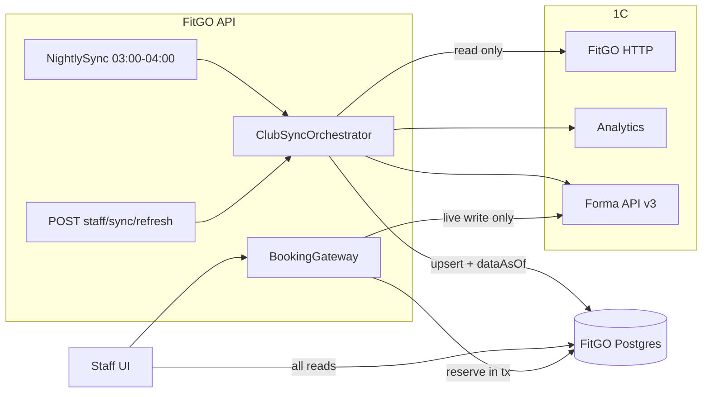

# Единая синхронизация 1С для приложения сотрудников

## Что есть сейчас (и почему болит)

- Пять отдельных ночных планировщиков с разными окнами: продажи 02–04 ([admin-sales-scheduler.service.ts](apps/api/src/admin-sales/admin-sales-scheduler.service.ts)), занятия и посещения 03–05 ([class-sync-scheduler.service.ts](apps/api/src/class-sync/class-sync-scheduler.service.ts)), задачи админа 03–05, вовлечённость и отток 04–06. Окна зависят от локального времени сервера (`getHours()`), признак «уже запускали сегодня» живёт в памяти.
- Блокировки от параллельного запуска только в памяти (`syncInFlight`, `running`, `inFlight: Set`), у каждого раздела своя. Строки в БД с признаком «выполняется» после перезапуска чистятся костылём `SYNC_ORPHAN_MS`.
- Многие экраны сотрудников всё ещё ходят в 1С при каждом открытии: расписание (кэш в памяти на 5 мин, [forma-schedule-cache.service.ts](apps/api/src/club-schedule/forma-schedule-cache.service.ts)), «Клиенты в зоне риска» (по 2 запроса в 1С на каждого клиента), карточка клиента у тренера, продажи ПТ в контроле записей, долги специалистов, долг сотрудника в расчёте ЗП, аналитика супер-админа.
- Кнопок «Обновить из 1С» несколько (продажи, контроль записей, ЗП, номенклатура, сотрудники), подпись о свежести данных есть только на главной админа и в продажах.
- Запись: на ГП сначала идёт запрос в 1С, потом зеркало в БД, без резерва и без ключа идемпотентности. ПТ и СПА проверяют пересечения в режиме «проверил, потом записал», поэтому одновременные запросы могут создать накладки. Списание СПА в 1С может пройти дважды. Позиции в листе ожидания считаются без блокировки.

## Целевая архитектура

Правило: **чтение — только из БД, в 1С ходим только с записями** (запись и отмена, отметка посещаемости, списание и продажа СПА, заморозка). Каждая операция записи сразу обновляет локальное зеркало, поэтому после неё нажимать «Обновить» не нужно.

## 1. Структура данных (Prisma, [schema.prisma](apps/api/prisma/schema.prisma))

**Состояние синхронизации:**

- `ClubSyncRun` — каждый запуск: `clubId`, `trigger` (NIGHTLY / MANUAL), `profile` (FULL / LIGHT), `status` (RUNNING / SUCCESS / PARTIAL / FAILED), `startedAt`, `finishedAt`, `heartbeatAt`, `triggeredByUserId`, `steps Json` (по каждому шагу: ресурс, период, строк, ошибка), `nightKey` (дата ночи, unique вместе с `clubId` для NIGHTLY).
- Частичный уникальный индекс через raw SQL в миграции: `CREATE UNIQUE INDEX club_sync_run_one_running ON "ClubSyncRun"("clubId") WHERE status = 'RUNNING'`. Это и есть inFlight на уровне БД: второй INSERT падает, и мы возвращаем уже идущий запуск. Переживает перезапуск, работает при нескольких инстансах.
- Зависший запуск: если `heartbeatAt` старше 3 мин, его можно перевести в FAILED и забрать блокировку (вместо `SYNC_ORPHAN_MS`).
- `SalesSyncState` оставляем как курсор по каждому ресурсу (`lastSuccessAt` для `admin_sales`, `club_revenue`, `class_sessions`, `hall_visits` и новых ключей ниже). Из него считается «Данные на …» для каждого раздела.

**Новые таблицы кэша** (заменяют живые чтения):

- `ClubScheduleSlot` — расписание ГП из Forma: `clubId`, `externalId` (appointment id), `title`, `trainerName`, `roomTitle`, `startAt`, `endAt`, `capacity`, `bookedIn1c`, `syncedAt`; `@@unique([clubId, externalId])`. Источник для расписания админа, ГП тренера, календаря ПТ и клиентского расписания.
- `ClubMembershipSnapshot` — абонемент по клиенту: `clientExternalId`, статус, даты, остатки услуг, долг, `freezeAllowed`, `syncedAt`. Заменяет живой `getMembership` в at-risk, карточке тренера, деталях задачи, долге сотрудника в ЗП.
- `TrainerPtSale` и `SpecialistServiceDebt` — вместо `GET /trainer-pt-sales` и `GET /specialist-service-debts` в контроле записей и ЗП.
- Посещения клиентов берём из уже существующих `ClubHallVisit` / `ClubVisitEvent`, без запросов по каждому клиенту.

**Зависимость от 1С:** для `ClubMembershipSnapshot` нужен пакетный эндпоинт, например `GET /memberships?changedSince=&page=` в расширении (`fitgo-probe/1c-extension`), и описание в [docs/FITGO_1C_HTTP_API.md](docs/FITGO_1C_HTTP_API.md). Пока его нет, ночью обходим только активных клиентов клуба с ограничением скорости, а днём живых запросов не делаем.

## 2. Оркестратор синхронизации

Новый модуль `apps/api/src/club-sync/`:

- `ClubSyncOrchestrator.run(clubId, trigger, profile)`: захватывает блокировку (INSERT в `ClubSyncRun`), выполняет шаги по порядку, каждые ~20 с обновляет `heartbeatAt`, пишет итог по шагу в `steps`. Шаги — это уже существующие сервисы: `AdminSalesSyncService`, `ClubRevenueSyncService`, `ClassSessionsSyncService`, `HallVisitsSyncService`, плюс новые: расписание, абонементы, продажи ПТ, долги специалистов, истекающие абонементы. Внутренние `Set`-блокировки этих сервисов убираем.
- **FULL** (ночь): 60 дней по продажам с перекрытием, расписание на сегодня+14 дней, занятия за месяц, посещения, абонементы, истекающие абонементы. После этого из БД без 1С считаются задачи админа, вовлечённость, отток и аналитика.
- **LIGHT** (кнопка): вчера–завтра для занятий и посещений, расписание сегодня+7 дней, продажи в инкрементальном режиме за сегодня±1 день, продажи ПТ и долги за текущий день.
- `NightlySyncScheduler` — один вместо пяти. Тик раз в 5 минут, окно 03:00–04:00 по `Europe/Moscow` (через `Intl`, не по часам сервера), ровно один запуск на клуб за ночь (unique `nightKey`). Если не уложились до 04:00, оставшиеся шаги помечаются как PARTIAL и не переносятся на день. Старые планировщики удаляются, их флаги `ENABLE_*_CRON` сводятся к одному `ENABLE_CLUB_SYNC_CRON`.

## 3. API для кнопки и подписи

- `GET staff/sync/status` (все роли сотрудников): `dataAsOf` (минимум `lastSuccessAt` по ключевым ресурсам), данные по разделам, `running` (кто запустил и когда), `cooldownUntil`, `nextNightlyAt`, `lastError` (только для админов).
- `POST staff/sync/refresh` (ADMIN и SUPER_ADMIN): если запуск уже идёт, возвращает `{status:'running', startedBy, startedAt}`. Если идёт кулдаун (10 мин после успешной выгрузки) или ночное окно 03:00–04:00, возвращает `{status:'cooldown', until}`. Иначе запускает фоновую работу и возвращает `{status:'started', runId}`. Нажавший вторым просто подключается к тому же опросу статуса.
- Каждый ответ с данными из 1С получает `meta.dataAsOf` своего раздела (например, продажи — по `club_revenue`, контроль записей — по `class_sessions`).
- Существующие эндпоинты `admin/sales/sync`, `booking-control/refresh-from-1c`, `class-sync/refresh-for-payroll`, `tasks/renewals/refresh` перенаправляем в оркестратор (LIGHT). Отдельные кнопки разделов уходят. Синхронизация сотрудников и номенклатуры остаётся отдельным действием супер-админа: это справочники, а не оперативные данные.

## 4. UI: чтобы было понятно, когда нажимать

Общий компонент `apps/web/src/components/data-freshness.tsx` (и копия в `apps/specialist-web`) ставится в шапку каждого раздела с данными из 1С:

- Текст: **«Данные на 06.10.2026 15:40»** (`dd.MM.yyyy HH:mm`, Europe/Moscow). Рядом источник: «ночная выгрузка» или «обновил Иванов».
- Цвет-подсказка: зелёный — меньше 60 мин или после ночной выгрузки до 10:00; жёлтый — больше 60 мин в рабочее время; красный — последняя ночная выгрузка не удалась или данным больше 24 ч.
- Кнопка «Обновить из 1С» видна только админам. Состояния: обычное; «Идёт обновление… (начал Иванов в 15:38)» со спиннером у всех сотрудников клуба; «Можно через 7 мин»; в 03:00–04:00 — «Идёт ночная выгрузка».
- Подсказка под кнопкой: «Нажимайте, только если в 1С за стойкой только что прошла оплата, запись или посещение, а здесь его нет. Записи и отметки, сделанные в FitGO, видны сразу».
- Опрос статуса раз в 5 с только пока `running`. По завершении данные на странице перезагружаются автоматически.
- Тренеры и СПА видят только подпись и статус, без кнопки.

## 5. Запись без двойных записей (единый `BookingGateway`)

Общие правила для всех типов записи:

- Ключ идемпотентности: UI генерирует uuid при открытии формы и отправляет его в заголовке `Idempotency-Key`. На брони поле `idempotencyKey @unique`, повтор возвращает ту же запись. Кнопка «Записать» блокируется до ответа.
- Резерв в транзакции БД, затем живая запись в 1С, затем подтверждение. Статусы: `PENDING_1C`, `CONFIRMED`, `FAILED`, `CANCELLED`.
- В `origin` пишем реальное происхождение (`STAFF_BOOKED`, `ADMIN_BOOKED`, новое `ONEC_IMPORTED`) и `bookedByUserId`.

**ГП** ([client.service.ts](apps/api/src/client/client.service.ts) `bookSession`, ~959):

1. Транзакция: `SELECT ... FOR UPDATE` строки `ClubScheduleSlot`. Проверка `bookedIn1c + pendingCount < capacity`. INSERT `GroupClassBooking(PENDING_1C)`; существующий `@@unique([clientId, appointmentId])` отсекает повторную запись того же клиента (отменённую запись реактивируем через UPDATE).
2. Вне транзакции — Forma `bookSession`. Успех или «уже записан» → `CONFIRMED`, `bookedIn1c += 1`. Отказ (мест нет) → `FAILED`, резерв снят, понятная ошибка. Таймаут → остаётся `PENDING_1C`.
3. Задача сверки раз в 2 мин (только для `PENDING_1C` старше 1 мин): точечно проверяет `getGroupSessionRoster` по этому занятию и подтверждает или снимает запись. Это единственное разрешённое фоновое чтение из 1С днём, и оно точечное.
4. Синхронизация занятий импортирует записи, сделанные прямо в 1С, как `GroupClassBooking(origin=ONEC_IMPORTED)`, поэтому проверка дублей видит и их.

**ПТ и СПА** ([personal-training.service.ts](apps/api/src/personal-training/personal-training.service.ts), [spa-booking.service.ts](apps/api/src/spa-booking/spa-booking.service.ts)):

- Ограничение исключения в Postgres (миграция: `CREATE EXTENSION btree_gist`): `EXCLUDE USING gist ("trainerId" WITH =, tstzrange("startAt","endAt") WITH &&) WHERE (status <> 'CANCELLED')`, то же для `specialistId`, а также для `clientId`, чтобы клиент не оказался одновременно у двух специалистов. Сейчас `@@unique([trainerId, startAt])` ловит только одинаковое время начала, его убираем.
- Ошибку `23P01` переводим в 409 «Слот уже занят» и возвращаем актуальные свободные слоты.
- `bookPersonalSession` получает ту же проверку пересечений, что и `assignPersonalBooking`.

**Списание СПА в 1С** ([service-usage.service.ts](apps/api/src/service-usage/service-usage.service.ts), ~518):

- Атомарный захват: `UPDATE "SpaBooking" SET "consumeState"='IN_PROGRESS' WHERE id=$1 AND "consumedInCrmAt" IS NULL AND "consumeState" IS NULL`. Если обновлено 0 строк, выходим.
- В 1С передаём `bookingRef=id`. Перед повтором после таймаута сначала проверяем `getSpaVisitStatus(bookingRef)` и только потом списываем.

**Лист ожидания** ([waitlist.service.ts](apps/api/src/waitlist/waitlist.service.ts)):

- `joinWaitlist` в транзакции с `pg_advisory_xact_lock(hashtext(appointmentId))`, позиция считается внутри блокировки.
- `confirmWaitlistSpot` использует условный UPDATE `WHERE status='NOTIFIED'` и дальше идёт через тот же путь записи на ГП (резерв, затем 1С).

## 6. Перевод экранов на чтение из БД

- Расписание (`club-schedule`, `gp-schedule`, календарь ПТ, клиентское расписание): читаем `ClubScheduleSlot`, кэш `FormaScheduleCacheService` удаляем.
- `admin/at-risk`, `admin/funnel`, карточка клиента у тренера, детали задачи: читаем `ClubMembershipSnapshot` и `ClubHallVisit`.
- Контроль записей и ЗП: читаем `TrainerPtSale`, `SpecialistServiceDebt`, долг сотрудника из `ClubMembershipSnapshot` и `ClubRevenueEntry`.
- Аналитика супер-админа: считаем из БД.
- Подтверждение в коде: запрет на чтения из 1С в HTTP-путях. Правило ревью в `.cursor/rules` и тест, который проверяет, что `fitness.getProvider()` вызывается только из `club-sync/*` и `BookingGateway`.

## Порядок внедрения

1. Модели и миграции, оркестратор с блокировкой в БД, `staff/sync/status|refresh`, единый ночной планировщик (старые выключаем).
2. Компонент `DataFreshness` на всех страницах сотрудников, объединение старых кнопок «Обновить из 1С».
3. Таблицы кэша (расписание, ПТ-продажи, долги) и перевод экранов на БД.
4. `BookingGateway`: ГП (резерв, 1С, сверка, импорт записей из 1С), ограничения исключения для ПТ и СПА, атомарное списание СПА, лист ожидания.
5. Пакетные абонементы (эндпоинт в 1С), перевод at-risk, ЗП и аналитики.
6. Проверка: два админа одновременно жмут кнопку (один запуск); перезапуск API во время выгрузки; ночь без повторов после перезапусков днём; параллельная запись двух сотрудников на последнее место; повтор запроса с тем же ключом.
